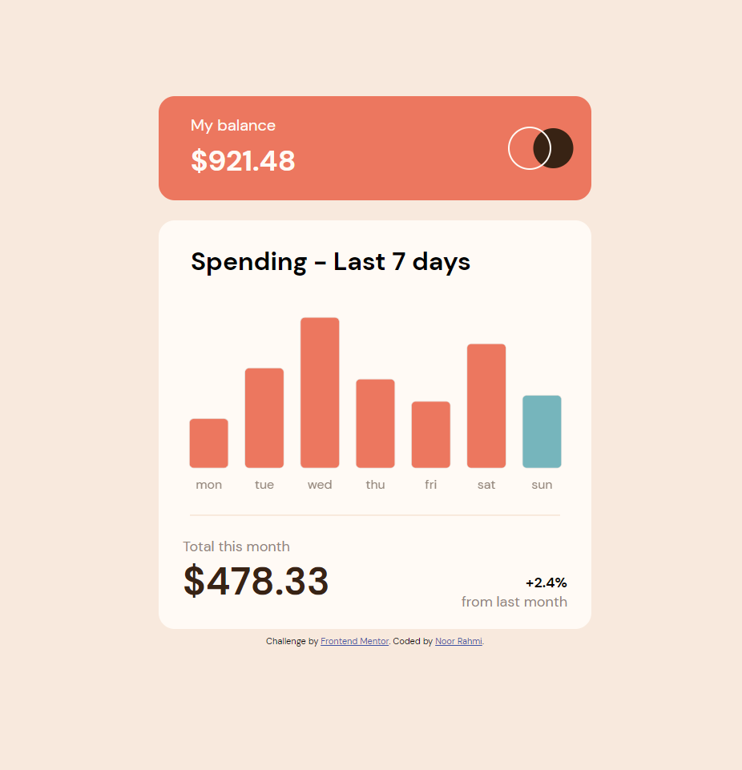
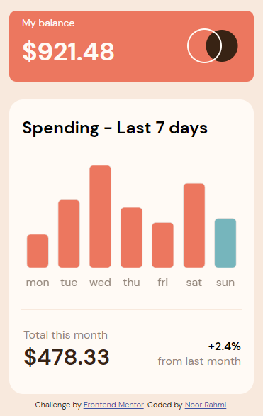

# Frontend Mentor - Expenses chart component solution

This is a solution to the [Expenses chart component challenge on Frontend Mentor](https://www.frontendmentor.io/challenges/expenses-chart-component-e7yJBUdjwt). Frontend Mentor challenges help you improve your coding skills by building realistic projects.

## Table of contents

- [Overview](#overview)
  - [The challenge](#the-challenge)
  - [Screenshot](#screenshot)
  - [Links](#links)
- [My process](#my-process)
  - [What I learned](#what-i-learned)
  - [Built with](#built-with)
  - [Continued development](#continued-development)
  - [Useful resources](#useful-resources)
- [Author](#author)

## Overview

### The challenge

Users should be able to:

- View the bar chart and hover over the individual bars to see the correct amounts for each day
- See the current day’s bar highlighted in a different colour to the other bars
- View the optimal layout for the content depending on their device’s screen size
- See hover states for all interactive elements on the page
- **Bonus**: Use the JSON data file provided to dynamically size the bars on the chart

### Screenshot

### Links

- Solution URL: (https://rahmi1016.github.io/expenses-chart-component-main/)
- Live Site URL: (https://rahmi1016.github.io/expenses-chart-component-main/)

## My process

### What I learned

- the "responsive" and "maintainAspectRatio" option in chart js did not work with SCSS, but worked with vanilla css.
- need to learn to use json file.

### Built with

- Semantic HTML5 markup
- CSS custom properties
- Flex
- Block
- [chart.js](https://www.chartjs.org//) - JS library for chart

### Continued development

- Chart.js

### Useful resources

- [Chart JS tutorial for beginners](https://www.youtube.com/watch?v=NySBh_DIRlg) - This helped me for utilizing chart.js
- [How to Customize the Tooltip Data in Chart JS](https://www.youtube.com/watch?v=ti0-q5bjuhE) - This video helped me understand how to customize tooltip in chart js.
- [Adding dollar sign](https://stackoverflow.com/questions/70080681/how-can-i-add-a-euro-sign-%E2%82%AC-to-all-tooltips-in-my-chart-js-line-chart) - This helped me to add dollar sign on tooltip label
- [JavaScript Date getDay()](https://www.w3schools.com/jsref/jsref_getday.asp) - This helped me got the current day name
- [How to assign colors in a chart based on values in chart js](https://www.youtube.com/watch?v=ylWoIaSgThk) - This video helped me to change bar color based on current day.
- [Fetch and Display Advanced JSON Data in Chart JS](https://www.youtube.com/watch?v=mw5i_QGDomw) - This video helped to use json file in chart.js

## Author

- Frontend Mentor - [@rahmi1016](https://www.frontendmentor.io/profile/rahmi1016)
